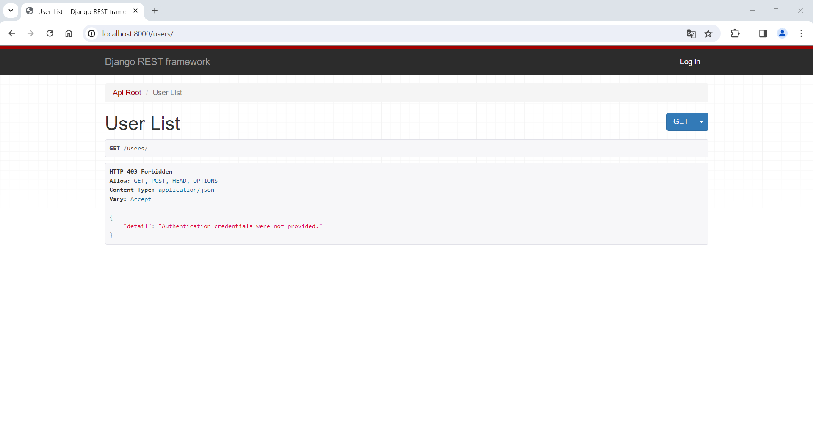

# DRF 공식 문서로 배워보기

[공식문서1](https://www.django-rest-framework.org/tutorial/quickstart/)

[공식문서2](https://www.django-rest-framework.org/)

공식문서1에서 설명이 잘 되어 있다.



여기서 이렇게 뜨는 이유는 로그인이 안 되어 있어서 그렇다. (공식문서1 마지막 단에 설명이 있음)

```
If you're working through the browser, make sure to login using the control in the top right corner.

Great, that was easy!
```

admin으로 로그인을 해주고 나면은 잘 보인다.


이제 CMD에서 curl을 사용해 보면


결과가 잘 나온다.

CMD에서 실행할 때는 따옴표 대신 쌍따옴표를 사용해 주어야 한다.

[에러 해결 참고](https://stackoverflow.com/questions/36361572/curl-6-could-not-resolve-host-application)